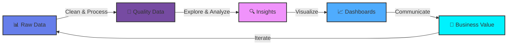

<div align="center">
  
</div>

<p align="center">
  <a href="https://git.io/typing-svg">
    
  </a>
</p>

<div align="center">
  
  
  
  <br/><br/>
  
</div>

<br/>

---

<div align="center">
  
## About Me

</div>

<table>
<tr>
<td width="50%" valign="top">

```yaml
name: Mohamed Darwish
role: Data Analyst
location: Egypt 🇪🇬
motto: "Turning Coffee ☕ Into Code & Data Into Insights 📊"

mission: |
  Transform complex data into clear, 
  actionable insights that drive 
  business decisions and create value.

experience: 0-1 Years
projects_completed: +1
certifications: +1

status:
  learning: [ Data Engineering ]
  working_on: [ Real-time Dashboards, ML Pipelines ]
  interested_in: [ AI, Business Intelligence, Analytics ]
  looking_for: [ Collaboration, New Opportunities ]
```

</td>
<td width="50%" valign="top">

<br/>

<div align="center">
  
</div>

</td>
</tr>
</table>

---

<div align="center">

### 🎨 My Data Analytics Journey



<sub><i>The continuous cycle of data-driven decision making</i></sub>

</div>

---

## 🛠️ Tech Stack & Tools

<div align="center">

### 💻 Programming Languages

<p>
  
</p>

### 📊 Data & Analytics

<table>
  <tr>
    <td align="center" width="25%">
      <h4>Analysis</h4>
      <br/>
      <br/>
      
    </td>
    <td align="center" width="25%">
      <h4>Visualization</h4>
      <br/>
      <br/>
      
    </td>
    <td align="center" width="25%">
      <h4>Databases</h4>
      <br/>
      <br/>
      
    </td>
    <td align="center" width="25%">
      <h4>Data Eng</h4>
      <br/>
      <br/>
      
    </td>
  </tr>
</table>

### 🧰 Development Tools

<p>
  
</p>

</div>

---

## 💬 Inspirational Quote

<div align="center">
  
</div>

---

## 🏆 Achievements & Certifications

<div align="center">

### 🎓 Professional Certifications

<table>
  <tr>
    <td align="center" width="33%">
      <a href="https://www.credly.com/users/darwish1337">
        
        <br/><br/>
        <b>🏅 View All Badges</b>
      </a>
    </td>
    <td align="center" width="33%">
      
      <br/><br/>
      <b>📜 10+ Certifications</b>
    </td>
    <td align="center" width="33%">
      
      <br/><br/>
      <b>🎯 5+ Specializations</b>
    </td>
  </tr>
</table>

### 🏅 Competitive Programming & Challenges

<table>
  <tr>
    <td align="center" width="50%">
      <a href="https://www.kaggle.com/darwish1337">
        
      </a>
      <br/><br/>
      <b>📊 Data Science Competitions</b>
      <br/><br/>
      
      
      <br/><br/>
      <sub>Competitions • Datasets • Notebooks</sub>
    </td>
    <td align="center" width="50%">
      <a href="https://leetcode.com/u/darwiish1337/">
        
      </a>
      <br/><br/>
      <b>💻 Algorithm Challenges</b>
      <br/><br/>
      
      
      <br/><br/>
      <sub>Data Structures • Algorithms • Problem Solving</sub>
    </td>
  </tr>
</table>

</div>

---

## 📊 GitHub Statistics

<div align="center">

<a href="https://github.com/darwiish1337">
  
  
</a>

<br/>

<a href="https://github.com/darwiish1337">
  
</a>

</div>

---

## 🏆 GitHub Highlights

<div align="center">

<br/>


<br/><br/>

<table>
  <tr>
    <td align="center">
      <a href="https://github.com/darwiish1337?tab=repositories">
        
      </a>
    </td>
    <td align="center">
      <a href="https://github.com/darwiish1337?tab=repositories">
        
      </a>
    </td>
    <td align="center">
      <a href="https://github.com/darwiish1337?tab=followers">
        
      </a>
    </td>
    <td align="center">
      <a href="https://github.com/darwiish1337?tab=repositories">
        
      </a>
    </td>
  </tr>
  <tr>
    <td align="center">
      <a href="https://github.com/darwiish1337?tab=repositories">
        
      </a>
    </td>
    <td align="center">
      <a href="https://github.com/darwiish1337?tab=repositories">
        
      </a>
    </td>
    <td align="center">
      <a href="https://github.com/darwiish1337?tab=repositories">
        
      </a>
    </td>
    <td align="center">
      <a href="https://github.com/darwiish1337?tab=repositories">
        
      </a>
    </td>
  </tr>
</table>

</div>

---

## 📈 Contribution Graph

<div align="center">

<a href="https://github.com/darwiish1337">
  
</a>

</div>

---

## 📫 Let's Connect!

<div align="center">

<table>
  <tr>
    <td align="center" width="25%">
      <a href="mailto:mdarwiish009@gmail.com">
        
        <br/><br/>
        
        <br/><br/>
        <b>Let's Talk</b>
      </a>
    </td>
    <td align="center" width="25%">
      <a href="https://www.linkedin.com/in/mohamed-darwish1337">
        
        <br/><br/>
        
        <br/><br/>
        <b>Connect</b>
      </a>
    </td>
    <td align="center" width="25%">
      <a href="https://github.com/darwiish1337">
        
        <br/><br/>
        
        <br/><br/>
        <b>Follow</b>
      </a>
    </td>
    <td align="center" width="25%">
      <a href="https://www.kaggle.com/darwish1337">
        
        <br/><br/>
        
        <br/><br/>
        <b>Compete</b>
      </a>
    </td>
  </tr>
</table>

</div>

---

<div align="center">
  


<br/>


<br/><br/>

**⭐ If you like what you see, consider starring this repository! ⭐**

<br/>

<a href="https://github.com/darwiish1337/darwiish1337">
  
</a>
<br/>
<a href="https://github.com/darwiish1337/darwiish1337">
  
</a>


<sub>Last Updated: February 2026 • Made by Mohamed Darwish</sub>


**💡 Remember:** *"The best way to predict the future is to analyze the data."* 📊✨

</div>
