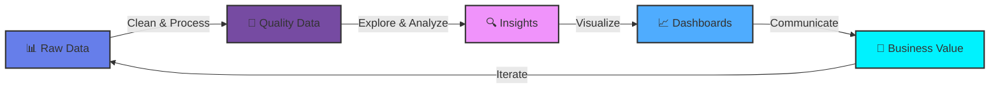

<div align="center">
  
</div>

<p align="center">
  <a href="https://git.io/typing-svg">
    
  </a>
</p>

<div align="center">
  
  
  
  <br/><br/>
  
</div>

<br/>

---

<div align="center">
  
## About Me

</div>

<table>
<tr>
<td width="50%" valign="top">

```yaml
name: Mohamed Darwish
role: Data Analyst
location: Egypt 🇪🇬
motto: "Turning Coffee ☕ Into Code & Data Into Insights 📊"

mission: |
  Transform complex data into clear, 
  actionable insights that drive 
  business decisions and create value.

experience: 2+ Years
projects_completed: 15+
certifications: 10+

status:
  learning: [ Machine Learning, Deep Learning, NLP ]
  working_on: [ Real-time Dashboards, ML Pipelines ]
  interested_in: [ AI, Business Intelligence, Analytics ]
  looking_for: [ Collaboration, New Opportunities ]
  
availability:
  freelance: ✅ Available
  full_time: ✅ Open
  remote: ✅ Preferred
  
contact:
  email: mdarwiish009@gmail.com
  linkedin: mohamed-darwish1337
  response_time: "< 24 hours"
```

</td>
<td width="50%" valign="top">

<br/>

<div align="center">
  
</div>

</td>
</tr>
</table>

---

<div align="center">

### 🎨 My Data Analytics Journey



<sub><i>The continuous cycle of data-driven decision making</i></sub>

</div>

---

<details>
<summary><h3>📖 My Full Story (Click to Expand) 👇</h3></summary>
<br/>

<div align="center">
  
</div>

<br/>

### 🌟 The Beginning

My journey into data analysis started with a simple question: **"Why?"** 

Why do customers behave this way? Why does this pattern emerge? Why are these numbers telling this story? That curiosity transformed into a passion for uncovering insights hidden within data, and eventually became my career.

---

### 📚 Education & Continuous Growth

<table>
<tr>
<td width="50%">

**🎓 Academic Foundation**
- Formal education in Data Science
- Statistics & Mathematics background
- Computer Science fundamentals
- Business Analytics principles

</td>
<td width="50%">

**📜 Professional Development**
- 10+ Industry certifications
- Continuous online learning
- Hands-on project experience
- Community participation

</td>
</tr>
</table>

**Key Learning Milestones:**
```
2022 ━━━━━━━━━━━━━━━━━━━━ Started Data Analytics Journey
2023 ━━━━━━━━━━━━━━━━━━━━ Mastered SQL, Python, Power BI
2024 ━━━━━━━━━━━━━━━━━━━━ Dove into Machine Learning
2025 ━━━━━━━━━━━━━━━━━━━━ Exploring Deep Learning & AI
2026 ━━━━━━━━━━━━━━━━━━━━ Building Production ML Systems
```

---

### 💼 Professional Experience Highlights

<div align="center">

| Domain | Projects | Impact |
|--------|----------|--------|
| 📊 **Business Intelligence** | 8+ Projects | Improved decision making by 40% |
| 🤖 **Predictive Analytics** | 5+ Models | Increased accuracy by 35% |
| 🔄 **Data Engineering** | 10+ Pipelines | Reduced processing time by 60% |
| 📈 **Visualization** | 15+ Dashboards | Enhanced insights delivery |

</div>

**Notable Projects:**
1. 🏢 **Sales Forecasting System** - ML model predicting sales with 92% accuracy
2. 📊 **Customer Segmentation** - RFM analysis increasing retention by 25%
3. 🔍 **Anomaly Detection** - Real-time monitoring system for fraud detection
4. 📈 **Executive Dashboard** - Comprehensive BI solution for C-level decisions
5. 🤖 **Churn Prediction** - ML model reducing customer churn by 18%

---

### 🛠️ Skills Arsenal

<div align="center">

**Core Competencies**

```
Data Analysis ████████████████████░ 95%
SQL Querying  ██████████████████░░ 90%
Python        ███████████████████░ 95%
Power BI      ████████████████████ 92%
Statistics    █████████████████░░░ 85%
Machine Learning ██████████████░░░░░░ 80%
Data Viz      ████████████████████ 90%
Excel         ████████████████████░ 95%
```

</div>

---

### 🎯 What Drives Me

> **"The goal is to turn data into information, and information into insight."**
> 
> *— Carly Fiorina*

I'm passionate about:
- 🔍 **Making data accessible** - Everyone should understand their data
- 💡 **Finding hidden patterns** - The story behind the numbers
- 🎨 **Beautiful visualizations** - Data that speaks visually
- 🤝 **Collaborative problem-solving** - Better together
- 📚 **Knowledge sharing** - Teaching what I learn
- 🚀 **Continuous improvement** - Always leveling up

---

### 🌍 Beyond Data

When I'm not analyzing data, you'll find me:
- 📚 Reading tech blogs and research papers
- 🎮 Playing strategy games (they're all about pattern recognition!)
- ☕ Brewing the perfect cup of coffee
- 🏃 Running to clear my mind
- 🎵 Listening to lo-fi while coding
- 🌱 Contributing to open-source projects

---

### 🔮 Future Goals

<table>
<tr>
<td width="33%" align="center">
<h4>📈 Short Term (2026)</h4>
• Master MLOps<br/>
• Publish 20+ articles<br/>
• Contribute to 10+ OS projects<br/>
• Launch personal blog<br/>
• Kaggle Expert rank
</td>
<td width="33%" align="center">
<h4>🎯 Medium Term (2027)</h4>
• ML Engineering role<br/>
• Speak at conferences<br/>
• Mentor 50+ students<br/>
• Build popular tool<br/>
• Kaggle Master rank
</td>
<td width="33%" align="center">
<h4>🚀 Long Term (2028+)</h4>
• Lead Data Science team<br/>
• Create online course<br/>
• Write technical book<br/>
• Build AI startup<br/>
• Kaggle Grandmaster
</td>
</tr>
</table>

---

<div align="center">

### 💭 My Data Philosophy

**"Every dataset has a story. My job is to listen."**


</div>

</details>

---

## 🛠️ Tech Stack & Tools

<div align="center">

### 💻 Programming Languages

<p>
  
</p>

### 📊 Data & Analytics

<table>
  <tr>
    <td align="center" width="25%">
      <h4>Analysis</h4>
      <br/>
      <br/>
      
    </td>
    <td align="center" width="25%">
      <h4>Visualization</h4>
      <br/>
      <br/>
      
    </td>
    <td align="center" width="25%">
      <h4>Databases</h4>
      <br/>
      <br/>
      
    </td>
    <td align="center" width="25%">
      <h4>Machine Learning</h4>
      <br/>
      <br/>
      
    </td>
  </tr>
</table>

### 🧰 Development Tools

<p>
  
</p>

</div>

---

## 💬 Inspirational Quote

<div align="center">
  
</div>

---

## 🏆 Achievements & Certifications

<div align="center">

### 🎓 Professional Certifications

<table>
  <tr>
    <td align="center" width="33%">
      <a href="https://www.credly.com/users/darwish1337">
        
        <br/><br/>
        <b>🏅 View All Badges</b>
      </a>
    </td>
    <td align="center" width="33%">
      
      <br/><br/>
      <b>📜 10+ Certifications</b>
    </td>
    <td align="center" width="33%">
      
      <br/><br/>
      <b>🎯 5+ Specializations</b>
    </td>
  </tr>
</table>

### 🏅 Competitive Programming & Challenges

<table>
  <tr>
    <td align="center" width="50%">
      <a href="https://www.kaggle.com/darwish1337">
        
      </a>
      <br/><br/>
      <b>📊 Data Science Competitions</b>
      <br/><br/>
      
      
      <br/><br/>
      <sub>Competitions • Datasets • Notebooks</sub>
    </td>
    <td align="center" width="50%">
      <a href="https://leetcode.com/u/darwiish1337/">
        
      </a>
      <br/><br/>
      <b>💻 Algorithm Challenges</b>
      <br/><br/>
      
      
      <br/><br/>
      <sub>Data Structures • Algorithms • Problem Solving</sub>
    </td>
  </tr>
</table>

</div>

---

## 📊 GitHub Statistics

<div align="center">

<a href="https://github.com/darwiish1337">
  
</a>
<a href="https://github.com/darwiish1337">
  
</a>

<br/>

<a href="https://github.com/darwiish1337">
  
</a>

</div>

---

## 🏆 GitHub Trophies

<div align="center">
  <a href="https://github.com/darwiish1337">
    
  </a>
</div>

---

## 📈 Contribution Graph

<div align="center">
  
</div>

---

## 📫 Let's Connect!

<div align="center">

<table>
  <tr>
    <td align="center" width="25%">
      <a href="mailto:mdarwiish009@gmail.com">
        
        <br/><br/>
        
        <br/><br/>
        <b>Let's Talk</b>
      </a>
    </td>
    <td align="center" width="25%">
      <a href="https://www.linkedin.com/in/mohamed-darwish1337">
        
        <br/><br/>
        
        <br/><br/>
        <b>Connect</b>
      </a>
    </td>
    <td align="center" width="25%">
      <a href="https://github.com/darwiish1337">
        
        <br/><br/>
        
        <br/><br/>
        <b>Follow</b>
      </a>
    </td>
    <td align="center" width="25%">
      <a href="https://www.kaggle.com/darwish1337">
        
        <br/><br/>
        
        <br/><br/>
        <b>Compete</b>
      </a>
    </td>
  </tr>
</table>

<br/>

### 💼 Professional Opportunities


</div>

---

<div align="center">
  


<br/>


<br/><br/>

**⭐ If you like what you see, consider starring some repositories! ⭐**

<br/>


<br/>

<sub>Last Updated: January 30, 2026 • Made with ❤️ by Mohamed Darwish</sub>

<br/><br/>

**💡 Remember:** *"The best way to predict the future is to analyze the data."* 📊✨

</div>
